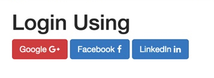

# Part -1 : Authorising user using Spring Social (Google, FaceBook and LinkedIn) and Spring Security

http://www.littlebigextra.com/part-1-authorising-user-using-spring-social-google-facebook-and-linkedin-and-spring-security/

## Introduction

소셜 로그인은 웹 응용 프로그램에서 점점 인기를 얻고 있으며 안전한 사용자 환경을 제공 할뿐만 아니라 암호 피로를 방지합니다. 암호를 기억할 수 없으므로 응용 프로그램에 로그온 할 수 없기 때문에 고객을 잃어 버리는 경우 암호 재설정 등의 작업을하지 않아도됩니다. 소셜 로그인은 Facebook과 같은 소셜 네트워크의 로그인 정보를 사용하는 싱글 사인온 (SSO) Twitter, Google+가 해당 웹 사이트 전용으로 새 로그인 계정을 만드는 대신 세 번째 웹 사이트에 로그온하십시오.

이전에 저는 Spring Social 기능에 대한 블로그를 거의 작성하지 않았습니다. Google에 대한 지원이 없으며 스프링 사회 등으로 허용되는 사용자가 한 명 뿐이며 예외가 거의없고 문제를 해결하는 방법도 있습니다. 모든 문제 및 스프링 사회를 사용하여 사용자를 등록하는 방법에 대해 자세히 설명하는 단계별 자습서 작성.

이 튜토리얼의 주요 목적은 스프링 보안과 스프링 - 소셜을 통합하고 사용자가 다음 중 하나의 방법으로 등록 할 수있는 웹 애플리케이션을 작성하는 것입니다.

* Registering their details
* Google
* Facebook
* LinkedIn

이 튜토리얼의 첫 번째 부분에서는 스프링 - 사회에서 데이터를 가져 와서 페이지의 세부 정보를 표시하는 것이지만, 두 번째 부분에서는 사용자에게 세부 정보를 입력하도록 요청할 스프링 보안을 통합하고 DB에 저장하십시오.

## Step 1- Maven Dependencies

간단한 스프링 부트 프로젝트를 만드는 방법을 알고 있다고 가정하면 프로젝트를 실행하는 데 필요한 종속 변수를 추가하는 단계로 넘어갑니다. 그렇지 않다면 스프링 스타터 프로젝트를 만들고 thymeleaf 및 웹 지원을 추가 할 수 있습니다.

**Spring-Social 의존성 추가하기**
첫 번째 단계는 스프링 - 사회 메이븐 저장소를 추가하는 것입니다. 종속성이 필요합니다.

```
<dependency>
 <groupId>org.springframework.social</groupId>
 <artifactId>spring-social-core</artifactId>
 <version>2.0.0.M2</version>
 </dependency>
 <dependency>
 <groupId>org.springframework.social</groupId>
 <artifactId>spring-social-config</artifactId>
 <version>2.0.0.M2</version>
 </dependency>
 <dependency>
 <groupId>org.springframework.social</groupId>
 <artifactId>spring-social-facebook</artifactId>
 <version>3.0.0.M1</version>
 </dependency>
 <dependency>
 <groupId>org.springframework.social</groupId>
 <artifactId>spring-social-linkedin</artifactId>
 </dependency>
 <dependency>
 <groupId>org.springframework.social</groupId>
 <artifactId>spring-social-google</artifactId>
 <version>1.0.0.RELEASE</version>
 </dependency>
 ```

 저장소를 사용할 수 없다는 오류가 발생하는 경우 다음 저장소를 pom에 추가해야 할 수 있습니다.

 ```
 <repositories>
 <repository>
 <id>alfresco-public</id>
 <url>https://artifacts.alfresco.com/nexus/content/groups/public</url>
 </repository>
 </repositories>
 ```

 **Adding Thymleaf, BootStrap, JQuery and Font-awesome dependencies**

웹 페이지가 멋지게 보이도록하기 위해 Bootstrap CSS, Font-awesome 및 Jquery를 추가하고 HTML에 thymeleaf를 사용합니다. 더 자세히 알고 싶다면 여기를 읽으십시오.

```
<dependency>
<groupId>org.springframework.boot</groupId>
<artifactId>spring-boot-starter-thymeleaf</artifactId>
</dependency>
<dependency>
<groupId>org.webjars</groupId>
<artifactId>jquery</artifactId>
<version>2.1.1</version>
</dependency>
<dependency>
<groupId>org.webjars</groupId>
<artifactId>bootstrap</artifactId>
<version>3.2.0</version>
</dependency>
<dependency>
<groupId>org.webjars</groupId>
<artifactId>webjars-locator</artifactId>
</dependency>
<dependency>
<groupId>org.webjars</groupId>
<artifactId>font-awesome</artifactId>
<version>4.7.0</version>
</dependency>
```

**Complete POM**

실수를 피하기 위해 다음은 완전한 POM.xml입니다.

```
<?xml version="1.0" encoding="UTF-8"?>
<project xmlns="http://maven.apache.org/POM/4.0.0" xmlns:xsi="http://www.w3.org/2001/XMLSchema-instance"
 xsi:schemaLocation="http://maven.apache.org/POM/4.0.0 http://maven.apache.org/xsd/maven-4.0.0.xsd">
 <modelVersion>4.0.0</modelVersion>

 <groupId>com.login</groupId>
 <artifactId>SpringLogin</artifactId>
 <version>0.0.1-SNAPSHOT</version>
 <packaging>jar</packaging>

 <name>SpringLogin</name>
 <description>Spring Login - Example POC</description>

 <parent>
 <groupId>org.springframework.boot</groupId>
 <artifactId>spring-boot-starter-parent</artifactId>
 <version>1.5.8.RELEASE</version>
 <relativePath /> <!-- lookup parent from repository -->
 </parent>

 <properties>
 <project.build.sourceEncoding>UTF-8</project.build.sourceEncoding>
 <project.reporting.outputEncoding>UTF-8</project.reporting.outputEncoding>
 <java.version>1.8</java.version>
 </properties>

 <dependencies>
 <dependency>
 <groupId>org.springframework.boot</groupId>
 <artifactId>spring-boot-devtools</artifactId>
 </dependency>
 <dependency>
 <groupId>org.springframework.boot</groupId>
 <artifactId>spring-boot-starter-thymeleaf</artifactId>
 </dependency>
 <dependency>
 <groupId>org.springframework.boot</groupId>
 <artifactId>spring-boot-starter-web</artifactId>
 </dependency>
 <dependency>
 <groupId>org.springframework.social</groupId>
 <artifactId>spring-social-core</artifactId>
 <version>2.0.0.M2</version>
 </dependency>
 <dependency>
 <groupId>org.springframework.social</groupId>
 <artifactId>spring-social-config</artifactId>
 <version>2.0.0.M2</version>
 </dependency>
 <dependency>
 <groupId>org.springframework.social</groupId>
 <artifactId>spring-social-facebook</artifactId>
 <version>3.0.0.M1</version>
 </dependency>
 <dependency>
 <groupId>org.springframework.social</groupId>
 <artifactId>spring-social-linkedin</artifactId>
 </dependency>
 <dependency>
 <groupId>org.springframework.social</groupId>
 <artifactId>spring-social-google</artifactId>
 <version>1.0.0.RELEASE</version>
 </dependency>
 <dependency>
 <groupId>org.springframework.boot</groupId>
 <artifactId>spring-boot-starter-test</artifactId>
 <scope>test</scope>
 </dependency>
 <!-- <dependency> <groupId>org.springframework.boot</groupId> <artifactId>spring-boot-starter-security</artifactId>
 </dependency> -->
 <dependency>
 <groupId>cglib</groupId>
 <artifactId>cglib</artifactId>
 <version>3.1</version>
 </dependency>
 <dependency>
 <groupId>org.webjars</groupId>
 <artifactId>jquery</artifactId>
 <version>2.1.1</version>
 </dependency>
 <dependency>
 <groupId>org.webjars</groupId>
 <artifactId>bootstrap</artifactId>
 <version>3.2.0</version>
 </dependency>
 <dependency>
 <groupId>org.webjars</groupId>
 <artifactId>webjars-locator</artifactId>
 </dependency>
 <dependency>
 <groupId>org.webjars</groupId>
 <artifactId>font-awesome</artifactId>
 <version>4.7.0</version>
 </dependency>
 <dependency>
 <groupId>org.springframework.boot</groupId>
 <artifactId>spring-boot-starter-data-jpa</artifactId>
 </dependency>
 <dependency>
 <groupId>org.hsqldb</groupId>
 <artifactId>hsqldb</artifactId>
 <scope>runtime</scope>
 </dependency>
 <dependency>
 <groupId>org.hibernate</groupId>
 <artifactId>hibernate-validator</artifactId>
 </dependency>

 </dependencies>
 <repositories>
 <repository>
 <id>alfresco-public</id>
 <url>https://artifacts.alfresco.com/nexus/content/groups/public</url>
 </repository>
 </repositories>
 <build>
 <plugins>
 <plugin>
 <groupId>org.springframework.boot</groupId>
 <artifactId>spring-boot-maven-plugin</artifactId>
 </plugin>
 </plugins>
 </build>

</project>
```

## Step 2- Adding Login Page and Controller

의존성이 해결되면보기 및 컨트롤러가 생성됩니다.

**Adding View**

시작하려면 Google, Facebook 및 로그인 각각 3 개의 버튼이있는보기를 만듭니다. 사용자가 그 중 하나를 클릭하면 선택한 공급자에 대한 승인을 묻는 메시지가 표시되며, 확인시 그의 세부 정보가 페이지에 표시됩니다.

src / main / resources / templates / login.html 아래에 다음 내용으로 파일을 만듭니다. 이보기에는 다른 제공 업체에 따라 각각 3 가지 형식이 있음에 유의하십시오.

```
<!doctype html>
<html lang="en">
<head>
<meta charset="utf-8" />
<meta http-equiv="X-UA-Compatible" content="IE=edge" />
<title>Login</title>
<meta name="description" content="" />
<meta name="viewport" content="width=device-width" />
<base href="/" />
<link rel="stylesheet" type="text/css" href="/webjars/bootstrap/css/bootstrap.min.css" />
<script type="text/javascript" src="/webjars/jquery/jquery.min.js"></script>
<script type="text/javascript" src="/webjars/bootstrap/js/bootstrap.min.js"></script>
<link rel="stylesheet" href="/webjars/font-awesome/css/font-awesome.min.css"></link>
</head>

<body>

 <div class="container">
 <h1>Login Using</h1>

 <form action="/connect/google" method="POST" style="display: inline">
 <input type="hidden" name="scope" value="profile email" />
 <button type="submit" class="btn btn-danger">
 Google <span class="fa fa-google-plus"></span>
 </button>
 </form>

 <form action="/connect/facebook" method="POST" style="display: inline">
 <input type="hidden" name="scope" value="public_profile,email" />
 <button type="submit" class="btn btn-primary">
 Facebook <span class="fa fa-facebook"></span>
 </button>
 </form>

 <form action="/connect/linkedin" method="POST" style="display: inline">
 <input type="hidden" name="scope"
 value="r_basicprofile,r_emailaddress" />
 <button type="submit" class="btn btn-primary">
 LinkedIn <span class="fa fa-linkedin"></span>
 </button>
 </form>
 </div>
</body>
</html>
```

**Adding Controller**

위의 페이지를 URL / 또는 / login에 매핑하는 간단한 메소드를 사용하여 com.login.controller 패키지에 LoginController라는 컨트롤러 클래스를 생성 해보자.

```
@Controller
public class LoginController {

@RequestMapping(value = { "/","/login" })
 public String login() {
 return "login";
 }
}
```

이제 위의 애플리케이션을 실행하면이 시점에서 이와 같은 페이지가 나타나야하며 당연히 아무 것도하지 않습니다.



## Step 3- Creating a POJO to show authorised user detail

Google에서 소셜 공급자를 통해 사용자를 확인하면 다른 페이지에 사용자 세부 정보가 표시됩니다. UserBean이라는 POJO에 이러한 세부 정보를 저장할 수 있습니다.
com.login.model 패키지에 아래와 같이 UserBean.java라는 클래스를 정의 해보자.

```
package com.login.model;

import java.beans.Transient;
import java.io.Serializable;

public class UserBean implements Serializable{

 private static final long serialVersionUID = 1L;
 private String firstName;
 private String lastName;
 private String email;
 private String title;
 private String country;
 private String password;
 private String passwordConfirm;
 private String provider;
 private String image;


 public String getEmail() {
 return email;
 }

 public String getImage() {
     return image;
 }

 public void setImage(String image) {
     this.image = image;
 }

 public void setEmail(String email) {
 this.email = email;
 }

 public String getPassword() {
 return password;
 }

 public void setPassword(String password) {
 this.password = password;
 }


 public String getPasswordConfirm() {
 return passwordConfirm;
 }

 public void setPasswordConfirm(String passwordConfirm) {
 this.passwordConfirm = passwordConfirm;
 }

 public String getTitle() {
 return title;
 }

 public void setTitle(String title) {
 this.title = title;
 }

 public String getCountry() {
 return country;
 }

 public void setCountry(String country) {
 this.country = country;
 }

 public String getFirstName() {
 return firstName;
 }

 public void setFirstName(String firstName) {
 this.firstName = firstName;
 }

 public String getLastName() {
 return lastName;
 }

 public void setLastName(String lastName) {
 this.lastName = lastName;
 }


 public String getProvider() {
 return provider;
 }

 public void setProvider(String provider) {
 this.provider = provider;
 }


}
```

## Step 4 – Creating Social Media Providers

Facebook, Google 및 LinkedIn의 경우, 인증을 수행하고 나중에 UserBean에 사용자 세부 정보를 저장하는 데 사용되는 Provider 클래스를 생성합니다.이 클래스는 나중에 페이지에 표시 할 수 있습니다. 시작하기 위해 모든 제공자가 초기화되는 생성자를 갖는 BaseProvider를 생성 할 것입니다.

이 BaseProvider는 Facebook, Google, LinkedIn 및 ConnectionRepository 저장소에 주입하여 만듭니다. 이 객체는 Spring Social의 Facebook, Google, LinkedIn 및 ConnectionRepository API 바인딩에 대한 참조입니다.

```
package com.login.social.providers;

import org.springframework.context.annotation.Configuration;
import org.springframework.context.annotation.Scope;
import org.springframework.context.annotation.ScopedProxyMode;
import org.springframework.social.connect.ConnectionRepository;
import org.springframework.social.facebook.api.Facebook;
import org.springframework.social.google.api.Google;
import org.springframework.social.linkedin.api.LinkedIn;

@Configuration
@Scope(value = "request",  proxyMode = ScopedProxyMode.TARGET_CLASS)
public class BaseProvider {

 private Facebook facebook;
 private Google google;
 private LinkedIn linkedIn;
 private ConnectionRepository connectionRepository;

 public  BaseProvider(Facebook facebook,Google google,  LinkedIn linkedIn, ConnectionRepository connectionRepository) {
 this.facebook = facebook;
 this.connectionRepository = connectionRepository;
 this.google=google;
 this.linkedIn= linkedIn;
 }

 public Facebook getFacebook() {
 return facebook;
 }

 public void setFacebook(Facebook facebook) {
 this.facebook = facebook;
 }

 public ConnectionRepository getConnectionRepository() {
 return connectionRepository;
 }

 public void setConnectionRepository(ConnectionRepository connectionRepository) {
 this.connectionRepository = connectionRepository;
 }

 public Google getGoogle() {
 return google;
 }

 public void setGoogle(Google google) {
 this.google = google;
 }

 public LinkedIn getLinkedIn() {
 return linkedIn;
 }

 public void setLinkedIn(LinkedIn linkedIn) {
 this.linkedIn = linkedIn;
 }


}
```

이제 각 공급자에 대한 공급자 클래스를 만들자.

**Facebook Provider**

우리는 아래의 Facebook 공급자를 사용하여 사용자를 승인 한 다음 Facebook 데이터에 액세스합니다. 가져온 사용자 데이터를 UserBean에 저장합니다.

```
package com.login.social.providers;

import org.springframework.beans.factory.annotation.Autowired;
import org.springframework.social.connect.ConnectionRepository;
import org.springframework.social.facebook.api.Facebook;
import org.springframework.social.facebook.api.User;
import org.springframework.stereotype.Service;
import org.springframework.ui.Model;

import com.login.model.UserBean;


@Service
public class FacebookProvider  {

 private static final String FACEBOOK = "facebook";
 private static final String REDIRECT_LOGIN = "redirect:/login";

     @Autowired
     BaseProvider baseProvider ;


 public String getFacebookUserData(Model model, UserBean userForm) {

 ConnectionRepository connectionRepository = baseProvider.getConnectionRepository();
 if (connectionRepository.findPrimaryConnection(Facebook.class) == null) {
 return REDIRECT_LOGIN;
 }
 populateUserDetailsFromFacebook(userForm);
 model.addAttribute("loggedInUser",userForm);
 return "user";
 }

 protected void populateUserDetailsFromFacebook(UserBean userForm) {
 Facebook facebook = baseProvider.getFacebook();
 User user = facebook.userOperations().getUserProfile();
 userForm.setEmail(user.getEmail());
 userForm.setFirstName(user.getFirstName());
 userForm.setLastName(user.getLastName());
 userForm.setImage(user.getCover().getSource());
 userForm.setProvider(FACEBOOK);
 }


}
```

**Google Provider**

Google은 아래의 Google 공급자를 사용하여 사용자를 승인 한 다음 Google 데이터에 액세스합니다. 가져온 사용자 데이터를 UserBean에 저장합니다.

```
package com.login.social.providers;

import org.springframework.beans.factory.annotation.Autowired;
import org.springframework.social.connect.ConnectionRepository;
import org.springframework.social.google.api.Google;
import org.springframework.social.google.api.plus.Person;
import org.springframework.stereotype.Service;
import org.springframework.ui.Model;

import com.login.model.UserBean;

@Service
public class GoogleProvider   {

 private static final String REDIRECT_CONNECT_GOOGLE = "redirect:/login";
 private static final String GOOGLE = "google";

   @Autowired
     BaseProvider socialLoginBean ;


 public String getGoogleUserData(Model model, UserBean userForm) {

 ConnectionRepository connectionRepository = socialLoginBean.getConnectionRepository();
 if (connectionRepository.findPrimaryConnection(Google.class) == null) {
 return REDIRECT_CONNECT_GOOGLE;
 }

 populateUserDetailsFromGoogle(userForm);
 model.addAttribute("loggedInUser",userForm);
 return "user";
 }


 protected void populateUserDetailsFromGoogle(UserBean userform) {
 Google google = socialLoginBean.getGoogle();
 Person googleUser = google.plusOperations().getGoogleProfile();
 userform.setEmail(googleUser.getAccountEmail());
 userform.setFirstName(googleUser.getGivenName());
 userform.setLastName(googleUser.getFamilyName());
 userform.setImage(googleUser.getImageUrl());
 userform.setProvider(GOOGLE);
 }

}
```

**LinkedIn Provider**

아래 링크 인 공급자를 사용하여 사용자를 인증 한 다음 LinkedIn 데이터에 액세스합니다. 가져온 사용자 데이터를 UserBean에 저장합니다.

```
package com.login.social.providers;

import org.springframework.beans.factory.annotation.Autowired;
import org.springframework.social.connect.ConnectionRepository;
import org.springframework.social.linkedin.api.LinkedIn;
import org.springframework.social.linkedin.api.LinkedInProfileFull;
import org.springframework.stereotype.Service;
import org.springframework.ui.Model;

import com.login.model.UserBean;

@Service
public class LinkedInProvider  {

 private static final String LINKED_IN = "linkedIn";

 private static final String REDIRECT_LOGIN = "redirect:/login";

   @Autowired
     BaseProvider socialLoginBean ;

 public String getLinkedInUserData(Model model, UserBean userForm) {

 ConnectionRepository connectionRepository = socialLoginBean.getConnectionRepository();
 if (connectionRepository.findPrimaryConnection(LinkedIn.class) == null) {
 return REDIRECT_LOGIN;
 }
 populateUserDetailsFromLinkedIn(userForm);
 model.addAttribute("loggedInUser",userForm);
 return "user";
 }

 private void populateUserDetailsFromLinkedIn(UserBean userForm) {
 LinkedIn linkedIn = socialLoginBean.getLinkedIn();
 LinkedInProfileFull linkedInUser = linkedIn.profileOperations().getUserProfileFull();
 userForm.setEmail(linkedInUser.getEmailAddress());
 userForm.setFirstName(linkedInUser.getFirstName());
 userForm.setLastName(linkedInUser.getLastName());
 userForm.setImage(linkedInUser.getProfilePictureUrl());
 userForm.setProvider(LINKED_IN);
 }

}
```

## Step 5 – Fixing some issues before we can run – Adding Google Support

지금까지 눈치 챘을 것이라면, 춘계 사회는 구글을 지원하지 않기 때문에, 스프링 - 사회 - 구글의 자동 설정을 가능하게하기 위해서 필요합니다.

**Add a GoogleAutoConfiguration Class**

스프링 소셜에는 스프링 - 소셜 - 구글 프로젝트가 있지만 Google에는 자동 구성이 없습니다. 그래서 Google 인증은 스프링 부트 자동 구성으로 곧바로 작동하지 않습니다.

spring-social-google의 자동 설정을 사용하려면

* Add a GoogleAutoConfiguration
* Add GoogleProperties

FacebookAutoConfiguration 클래스에서 org.springframework.boot.autoconfigure.social 패키지를 찾을 수 있어야합니다. spring-autoconfigure.jar의 패키지는 Facebook의 자동 구성을 수행합니다. 치트 시트 또는 트릭은 이 파일을 복사하고 Facebook을 Google로 대체하는 것입니다. GoogleAutoConfiguration을 사용하도록 설정하는 방법

또는 아래 클래스를 복사하여 패키지를 넣고 클래스 경로 (src / main / java 또는 다른 소스 폴더 내부)에서 사용할 수 있는지 확인하십시오.

```
package com.login.config.google;

import org.springframework.boot.autoconfigure.AutoConfigureAfter;
import org.springframework.boot.autoconfigure.AutoConfigureBefore;
import org.springframework.boot.autoconfigure.EnableAutoConfiguration;
import org.springframework.boot.autoconfigure.condition.ConditionalOnClass;
import org.springframework.boot.autoconfigure.condition.ConditionalOnMissingBean;
import org.springframework.boot.autoconfigure.condition.ConditionalOnProperty;
import org.springframework.boot.autoconfigure.condition.ConditionalOnWebApplication;
import org.springframework.boot.autoconfigure.social.SocialAutoConfigurerAdapter;
import org.springframework.boot.autoconfigure.social.SocialWebAutoConfiguration;
import org.springframework.boot.autoconfigure.web.WebMvcAutoConfiguration;
import org.springframework.boot.context.properties.EnableConfigurationProperties;
import org.springframework.context.annotation.Bean;
import org.springframework.context.annotation.Configuration;
import org.springframework.context.annotation.Scope;
import org.springframework.context.annotation.ScopedProxyMode;
import org.springframework.social.config.annotation.EnableSocial;
import org.springframework.social.config.annotation.SocialConfigurerAdapter;
import org.springframework.social.connect.Connection;
import org.springframework.social.connect.ConnectionFactory;
import org.springframework.social.connect.ConnectionRepository;
import org.springframework.social.connect.web.GenericConnectionStatusView;
import org.springframework.social.google.api.Google;
import org.springframework.social.google.connect.GoogleConnectionFactory;


@Configuration
@ConditionalOnClass({ SocialConfigurerAdapter.class, GoogleConnectionFactory.class })
@ConditionalOnProperty(prefix = "spring.social.google", name = "app-id")
@AutoConfigureBefore(SocialWebAutoConfiguration.class)
@AutoConfigureAfter(WebMvcAutoConfiguration.class)
public class GoogleAutoConfiguration {

 @Configuration
 @EnableSocial
 @EnableConfigurationProperties(GoogleProperties.class)
 @ConditionalOnWebApplication
 protected static class GoogleConfigurerAdapter extends SocialAutoConfigurerAdapter {

 private final GoogleProperties properties;

 protected GoogleConfigurerAdapter(GoogleProperties properties) {
 this.properties = properties;
 }

 @Bean
 @ConditionalOnMissingBean(Google.class)
 @Scope(value = "request", proxyMode = ScopedProxyMode.INTERFACES)
 public Google google(ConnectionRepository repository) {
 Connection<Google> connection = repository.findPrimaryConnection(Google.class);
 return connection != null ? connection.getApi() : null;
 }

 @Bean(name = { "connect/googleConnect", "connect/googleConnected" })
 @ConditionalOnProperty(prefix = "spring.social", name = "auto-connection-views")
 public GenericConnectionStatusView googleConnectView() {
 return new GenericConnectionStatusView("google", "Google");
 }

 @Override
 protected ConnectionFactory<?> createConnectionFactory() {
 return new GoogleConnectionFactory(this.properties.getAppId(), this.properties.getAppSecret());
 }

 }

}
```

**Add GoogleProperties**

동일한 패키지에 아래 클래스를 추가하십시오.이 속성은 Google의 속성 파일에 비밀 키를 추가 할 때 필요합니다. 우리는 어떤 오류도 보지 않을 것입니다.

```
package com.login.config.google;

import org.springframework.boot.autoconfigure.social.SocialProperties;
import org.springframework.boot.context.properties.ConfigurationProperties;

@ConfigurationProperties(prefix = "spring.social.google")

public class GoogleProperties extends SocialProperties{


}
```

Read Here: [How to access Google data using spring-social](http://littlebigextra.com/access-google-data-using-spring-social/)

## Step 6- Fixing some issues before we can run – Changing the default spring social redirect face flow

스프링 소셜은 빠르고 쉽게 시작할 수 있지만 프로덕션에 사용하기 전에 몇 가지 구성이 필요합니다. 기본 흐름

기본적으로 사용자 흐름은 login.html -> connect / facebookConnected.html이므로 제출 URL이 무엇인지에 관계없이 페이스 북은 흐름을 무시하고 connect / facebookConnected.html로 리디렉션합니다.

Read Here: [How to change the default spring social redirect page flow](http://littlebigextra.com/how-to-change-the-default-spring-social-redirect-flow/)

connectedView 메소드를 오버라이드하고 "/ facebook", "/ google"또는 "/ LinkedIn"으로 리디렉션하는 ChangeDefaultFlowController를 추가합니다.

```
package com.login.controller;

import org.springframework.social.connect.ConnectionFactoryLocator;
import org.springframework.social.connect.ConnectionRepository;
import org.springframework.social.connect.web.ConnectController;
import org.springframework.stereotype.Controller;
import org.springframework.web.bind.annotation.RequestMapping;


@Controller
@RequestMapping("/connect")
public class ChangeDefaultFlowController extends ConnectController {

 public ChangeDefaultFlowController(ConnectionFactoryLocator connectionFactoryLocator,
 ConnectionRepository connectionRepository) {
 super(connectionFactoryLocator, connectionRepository);
 }

 @Override
    protected String connectedView(String providerId) {
        return "redirect:/"+providerId;
    }

}
```

## Step 7 – Fixing some issues before we can run – Allowing Multiple Users to Login

Spring Facebook 예제를 테스트 해 보면 FB 데이터에 액세스하면 한 명의 사용자 만 지원한다는 것을 알 수 있습니다. 따라서 첫 번째 사용자가 Facebook에 로그인하면 새로운 세부 세션 / 사용자 전체에서 그의 세부 정보 만 공유되며 어떤 종류의 인증도 요청되지 않습니다. 포럼 중 하나는이 예제가 수행 할 수있는 작업과 프로덕션 용도로 사용하지 않는 작업을 설명하기로되어 있다고합니다.

Read Here: [Spring Social Facebook Authentication Example for multiple users](http://littlebigextra.com/how-to-fix-spring-social-facebook-one-user-per-application-problem/)

이 문제를 해결하려면 항상 "익명"문자열을 반환하는 메서드를 재정의해야합니다.이 솔루션은 각 새 사용자 / 세션의 UserId로 "익명"을 재정의하는 것입니다. 따라서 각 세션에 대해 SessionID를 반환 할 수는 있지만 특히 연결 데이터베이스의 어딘가에 캐시되거나 저장되는 경우 사용자를 식별 할만큼 고유하지 않을 수 있습니다.
UUID (Universally Unique Identifier)를 사용하는 것이 더 안전 할 수 있습니다. 따라서 새로운 UUID를 세션에 저장하므로 여러 요청간에 유지되지만 세션이 유효 할 때까지 살아 있습니다. 트릭을 수행하는 아래의 메소드를 참조하십시오.

```
package com.login.identifier;

import java.util.UUID;

import org.springframework.context.annotation.Configuration;
import org.springframework.social.UserIdSource;
import org.springframework.social.config.annotation.SocialConfigurerAdapter;
import org.springframework.web.context.request.RequestAttributes;
import org.springframework.web.context.request.RequestContextHolder;


@Configuration
public class SessionIdentifier extends SocialConfigurerAdapter
{

    @Override
    public UserIdSource getUserIdSource() {
        return new SessionIdUserIdSource();
    }

    private static final class SessionIdUserIdSource implements UserIdSource {
    	@Override
        public String getUserId() {
            RequestAttributes request = RequestContextHolder.currentRequestAttributes();
            String uuid = (String) request.getAttribute("_socialUserUUID", RequestAttributes.SCOPE_SESSION);
            if (uuid == null) {
                uuid = UUID.randomUUID().toString();
                request.setAttribute("_socialUserUUID", uuid, RequestAttributes.SCOPE_SESSION);
            }
            return uuid;
        }
    }
}
```

## Step 8 – Updating the LoginController

이제 모든 수정 사항을 추가 했으므로 뷰를 컨트롤러로 업데이트 할 수 있도록 컨트롤러를 업데이트해야합니다.

```
package com.login.controller;

import org.springframework.beans.factory.annotation.Autowired;
import org.springframework.stereotype.Controller;
import org.springframework.ui.Model;
import org.springframework.web.bind.annotation.RequestMapping;
import org.springframework.web.bind.annotation.RequestMethod;

import com.login.model.UserBean;
import com.login.social.providers.FacebookProvider;
import com.login.social.providers.GoogleProvider;
import com.login.social.providers.LinkedInProvider;

@Controller
public class LoginController {

 @Autowired
 FacebookProvider facebookProvider;

 @Autowired
 GoogleProvider googleProvider;

 @Autowired
 LinkedInProvider linkedInProvider;

 @RequestMapping(value = "/facebook", method = RequestMethod.GET)
 public String loginToFacebook(Model model) {
 return facebookProvider.getFacebookUserData(model, new UserBean());
 }

 @RequestMapping(value = "/google", method = RequestMethod.GET)
 public String loginToGoogle(Model model) {
 return googleProvider.getGoogleUserData(model, new UserBean());
 }

 @RequestMapping(value = "/linkedin", method = RequestMethod.GET)
 public String helloFacebook(Model model) {
 return linkedInProvider.getLinkedInUserData(model, new UserBean());
 }

 @RequestMapping(value = { "/","/login" })
 public String login() {
 return "login";
 }

}
```

## Step 9 – Adding Spring properties

이 예제 목적을 위해 Google / FB 및 LinkedIn에 API 및 공개 / 비공개 키를 등록하는 방법을 알고 있다고 가정하면 아래 속성 파일을 사용할 수 있습니다.
또한 서버는 포트 3000에서 시작합니다 (변경하지 마십시오.이 키로 등록 된 URL은 localhost : 3000입니다.

```
spring.social.facebook.appId=384261248599251
spring.social.facebook.appSecret=fd7fa1c5f5a267f463263a0ce7ff2025

spring.social.linkedin.app-id=771mrzk94hye1w
spring.social.linkedin.app-secret=iIJFgBf9lCb18zYe

spring.social.google.appId=12894100090-tqso3lih5o42isneort886la2pesafmp.apps.googleusercontent.com
spring.social.google.appSecret=9xfU16efvxQ-BTMsXT9wOLpw

server.port:3000
```

## Step 10 – User Details on page

페이지에 인증 된 사용자를 표시하기 위해 thymeleaf를 사용하여 UserBean을 표시합니다. 아래의 html 페이지를 src / main / resources / static / as user.html에 추가하십시오.

```
<!doctype html>
<html lang="en">
<head>
<meta charset="utf-8" />
<meta http-equiv="X-UA-Compatible" content="IE=edge" />
<title>Login</title>
<meta name="description" content="" />
<meta name="viewport" content="width=device-width" />
<meta name="ctx" th:content="${#httpServletRequest.getContextPath()}" />
<base href="/" />
<link rel="stylesheet" type="text/css" href="/webjars/bootstrap/css/bootstrap.min.css" />
<script type="text/javascript" src="/webjars/jquery/jquery.min.js"></script>
<script type="text/javascript" src="/webjars/bootstrap/js/bootstrap.min.js"></script>
<link rel="stylesheet" href="/webjars/font-awesome/css/font-awesome.min.css"></link>
</head>
<body>


 <div class="container">
 <br /><br /><br />
 <form th:object="${loggedInUser}" method="post">
 <div class="row">
 <label for="username">Username:</label>
 <span th:text="${loggedInUser.email}" />
 </div>
 <div class="row">
 <label for="firstName">Name:</label>
 <span th:text="*{firstName}" /> <span th:text="*{lastName}" />
 </div>
 <div class="row">
 <label for="image">Name:</label>
 
 </div>

 </form>
 <br />
   <a href="/login" th:href="@{/login}" class="btn btn-info btn-lg">
          <span class="glyphicon glyphicon-chevron-left"></span> Login using  other social Providers
         </a>

 </div>

</body>
</html>
```

이제 프로젝트를 실행하고 http : // localhost : 3000 / login에서 애플리케이션에 액세스하십시오.

선택한 공급자에 따라 인증 팝업이 표시되어야하며 사용자 이름, 이름, 프로필 이미지가 아래와 같이 표시 될 페이지로 리디렉션되어야합니다.

## Conclusion

Spring Social API는 사회 공급자와 인증 메커니즘을 구현하는 데 도움이됩니다. 사용하기 쉽고 필요에 맞게 구성하는 방법을 살펴 보았습니다.

Above code can be cloned from here at [Github](https://github.com/abhishek-galoda/springsociallogin-part1.git)
