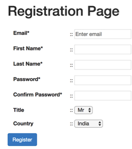
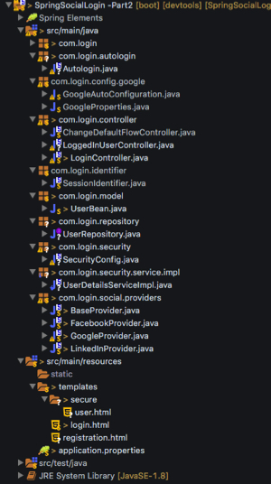
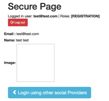

# Part-2: Authorising user using Spring Social (Google, Facebook, LinkedIn) and Spring Security

http://littlebigextra.com/part-2-authorising-user-using-spring-social-google-facebook-linkedin-spring-security/

## Introduction

마지막 부분에서는 Facebook, Google 및 LinkedIn API를 사용하여 사용자에게 Spring-Social을 사용하여 권한을 부여하는 방법을 보여주었습니다. 마지막 부분을 읽지 않았다면, 돌아가서 먼저 살펴보시기를 권합니다.
이번에는 스프링 보안을 사용하여 로그인 한 사용자 또는 인증 된 사용자 만 보안 페이지로 이동할 수있게하고 보안 페이지로 이동하려는 모든 사용자는 인증을 위해 로그인 페이지로 리디렉션됩니다.
일단 사용자가 인증되면 우리는 그의 세부 정보를 메모리 내 DB에 저장하고 사용자는 로그 아웃 한 다음 다시 로그인 할 수 있습니다.

Spring Security 프레임 워크는 애플리케이션에 인증 및 권한 부여 기능을 제공합니다. 또한 세션 고정, 클릭 재킹, 사이트 간 요청 위조 등과 같은 공격을 예방하는 데 도움이되며 좋은 점은 다양한 사용 사례에 쉽게 맞게 사용자 지정할 수 있다는 것입니다.
이 튜토리얼에서는 스프링 소셜 API로 스프링 보안을 추가하여 사용자를 등록한 다음 로그온 및 로그 아웃 기능을 추가한다.

## Step 1 – Adding Maven dependencies

시작하는 첫 번째 단계는 Spring 보안을위한 maven 의존성을 추가하는 것이다.
또한 페이지에 로그인 된 사용자 및 역할 등을 표시하기 위해 스프링 보안 태그를 사용하는 thymeleaf-extras-spring 보안에 대한 maven 종속성을 추가 할 예정입니다.
POM.xml에 다음 종속성을 추가하십시오.

```
<dependency>
         <groupId>org.springframework.boot</groupId>
 <artifactId>spring-boot-starter-security</artifactId>
 </dependency>
 <dependency>
 <groupId>org.springframework.security</groupId>
 <artifactId>spring-security-web</artifactId>
 </dependency>
 <dependency>
 <groupId>org.springframework.security</groupId>
 <artifactId>spring-security-config</artifactId>
 </dependency>
 <dependency>
      	               <groupId>org.thymeleaf.extras</groupId>
                       <artifactId>thymeleaf-extras-springsecurity4</artifactId>
   	      </dependency>
```

## Step 2 – Registering user on site

소셜 네트워킹 플랫폼에 로그온 할 때 API를 통해 사용자 세부 정보를 가져 오는 형식은 필요하지 않았습니다. 그러나 사용자를 등록하려면 간단한 정보가 필요합니다. src / main / resources / templates / registration.html에 registration.html이라는 뷰를 생성 할 것이다.
이 양식에는 서버 측 유효성 검사와 최소 CSS / JS가 있습니다.



등록 페이지의 소스 코드는 다음과 같습니다.

```
<!doctype html>
<html lang="en">
<head>
<meta charset="utf-8" />
<meta http-equiv="X-UA-Compatible" content="IE=edge" />
<title>Login</title>
<meta name="description" content="" />
<meta name="viewport" content="width=device-width" />
<base href="/" />
<link rel="stylesheet" type="text/css" href="/webjars/bootstrap/css/bootstrap.min.css" />
<script type="text/javascript" src="/webjars/jquery/jquery.min.js"></script>
<script type="text/javascript" src="/webjars/bootstrap/js/bootstrap.min.js"></script>
<link rel="stylesheet" href="/webjars/font-awesome/css/font-awesome.min.css"></link>
</head>
 
<body>
 <div class="container" style="width:80%">
 <h1>Registration Page</h1>
 <br />
 <form action="#" th:action="@{/registration}" th:object="${userBean}" method="post" >
 <div class="form-group" >
 <label for="email" class="control-label col-sm-2">Email*</label>:: <input type="text" th:field="*{email}"  placeholder="Enter email"/>
 <div style="width:33%"  th:if="${#fields.hasErrors('email')}" th:errors="*{email}" class="alert alert-danger">Email Error</div>
 </div>
 <div class="form-group">
 <label for="firstName" class="control-label col-sm-2">First Name*</label>:: <input type="text" th:field="*{firstName}" />
 <div style="width:33%" th:if="${#fields.hasErrors('firstName')}" th:errors="*{firstName}" class="alert alert-danger">FirstName Error</div>
 </div>
 <div class="form-group">
 <label for="lastName" class="control-label col-sm-2">Last Name*</label>:: <input type="text" th:field="*{lastName}" />
 <div style="width:33%" th:if="${#fields.hasErrors('lastName')}" th:errors="*{lastName}" class="alert alert-danger">LastName Error</div>
 </div>
 <div class="form-group">
 <label for="password" class="control-label col-sm-2">Password*</label>:: <input type="text" th:field="*{password}" />
 <div style="width:33%" th:if="${#fields.hasErrors('password')}" th:errors="*{password}" class="alert alert-danger">Password Error</div>
 </div>
 <div class="form-group">
 <label for="passwordConfirm" class="control-label col-sm-2">Confirm Password*</label>:: <input type="text" th:field="*{passwordConfirm}" />
 <div style="width:33%" th:if="${#fields.hasErrors('passwordConfirm')}" th:errors="*{passwordConfirm}" class="alert alert-danger">Password Error</div>
 </div>
 <div class="form-group">
 <label for="title" class="control-label col-sm-2">Title</label>:: <select th:field="*{title}">
 <option value="Mr" th:text="Mr"></option>
 <option value="Mrs" th:text="Mrs"></option>
 </select>
 <div th:if="${#fields.hasErrors('title')}" th:errors="*{title}">Title Error</div>
 </div>
 <div class="form-group">
 <label for="country" class="control-label col-sm-2">Country</label>:: <select th:field="*{country}">
 <option value="India" th:text="India"></option>
 <option value="UK" th:text="UK"></option>
 <option value="US" th:text="US"></option>
 <option value="Japan" th:text="Japan"></option>
 </select>
 <div th:if="${#fields.hasErrors('country')}" th:errors="*{country}" class="alert alert-danger">Country Error</div>
 </div>
 <input type="hidden" name="provider"  value="registration" />
 <div class="form-group">
 <button type="submit" class="btn btn-primary">Register</button>
 </div>
 </form>
 
 </div>
</body>
</html>
```

**Modifying the Controller**

이 페이지를 제공하기 위해 기존 로그인 컨트롤러를 수정합니다.

```
@GetMapping("/registration")
    public String showRegistration(UserBean userBean) {
 return "registration";
    }
```

**Modifying the Login Page**

이제 로그인 페이지를 수정하고 홈 페이지에 등록 링크를 추가하고 사용자 이름과 비밀번호 필드를 추가하여 사용자가 등록되면 로그인 할 수도 있습니다.

이 HTML 조각은 사용자를 찾을 수없는 경우 오류 메시지와 함께 사용자 이름 / 암호 필드를 추가합니다.

```
<form th:action="@{/login}" method="post" style="display: inline">
 <label for="username">Username</label>: <input type="text" id="username" name="username" autofocus="autofocus" /> <br />
 <label for="password">Password</label>: <input type="password" id="password" name="password" /> <br />
 <p th:if="${loginError}" class="alert alert-danger">Wrong email or password combination</p>
 <button type="submit" class="btn btn-primary">
 <span class="fa fa-user"></span>Login
 </button>
 </form>
```

또한 Logged In 사용자, 할당 된 역할 및 로그 아웃 버튼을 표시하는 또 다른 코드 조각을 추가합시다.

```
<div th:fragment="logout" class="logout" sec:authorize="isAuthenticated()">
 Logged in user: <b><span sec:authentication="name"></span></b> | Roles: <b><span sec:authentication="authorities"></span></b>
 <form action="#" th:action="@{/logout}" method="post">
        <button type="submit"  class="btn btn-danger btn-sm"
        <span class="glyphicon glyphicon-log-out"></span>
         Log out</button>
 </form>
 </div>
```

Google, Facebook 및 LinkedIn의 기존 양식에 csrf 토큰이 필요합니다.

```
<input type="hidden" th:name="${_csrf.parameterName}" th:value="${_csrf.token}" />
```

이것이 완전한 login.html의 모습입니다.


login.html의 소스 코드

```
<!doctype html>
<html lang="en">
<head>
<meta charset="utf-8" />
<meta http-equiv="X-UA-Compatible" content="IE=edge" />
<title>Login</title>
<meta name="description" content="" />
<meta name="viewport" content="width=device-width" />
<base href="/" />
<link rel="stylesheet" type="text/css" href="/webjars/bootstrap/css/bootstrap.min.css" />
<script type="text/javascript" src="/webjars/jquery/jquery.min.js"></script>
<script type="text/javascript" src="/webjars/bootstrap/js/bootstrap.min.js"></script>
<link rel="stylesheet" href="/webjars/font-awesome/css/font-awesome.min.css"></link>
</head>
 
<body>
 
 <div class="container">
 
 <div th:fragment="logout" class="logout" sec:authorize="isAuthenticated()">
 Logged in user: <b><span sec:authentication="name"></span></b> | Roles: <b><span sec:authentication="authorities"></span></b>
 <form action="#" th:action="@{/logout}" method="post">
        <button type="submit"  class="btn btn-danger btn-sm">
        <span class="glyphicon glyphicon-log-out"></span>
         Log out</button>
 </form>
 </div>
 <br/>
 
 <h1>Login Using</h1>
 
 <form th:action="@{/login}" method="post" style="display: inline">
 <label for="username">Email   </label> : <input type="text" id="username" name="username" autofocus="autofocus" placeholder="Enter email"/> <br />
 <label for="password">Password</label>: <input type="password" id="password" name="password" /> <br />
 <p th:if="${loginError}" class="alert alert-danger">Wrong email or password combination</p>
 <button type="submit" class="btn btn-primary">
 <span class="fa fa-user"></span>Login
 </button>
 </form>
 
 <form action="/connect/google" method="POST" style="display: inline">
 <input type="hidden" th:name="${_csrf.parameterName}" th:value="${_csrf.token}" /> 
 <input type="hidden" name="scope" value="profile email" />
 <button type="submit" class="btn btn-danger">
 Google <span class="fa fa-google-plus"></span>
 </button>
 </form>
 
 <form action="/connect/facebook" method="POST" style="display: inline">
 <input type="hidden" th:name="${_csrf.parameterName}" th:value="${_csrf.token}" /> 
 <input type="hidden" name="scope" value="public_profile,email" />
 <button type="submit" class="btn btn-primary">
 Facebook <span class="fa fa-facebook"></span>
 </button>
 </form>
 
 <form action="/connect/linkedin" method="POST" style="display: inline">
 <input type="hidden" th:name="${_csrf.parameterName}" th:value="${_csrf.token}" /> 
 <input type="hidden" name="scope"
 value="r_basicprofile,r_emailaddress" />
 <button type="submit" class="btn btn-primary">
 LinkedIn <span class="fa fa-linkedin"></span>
 </button>
 </form>
 <br />
 <h3>
 <p class="bg-important">
 <a href="/registration" th:href="@{/registration}">Create Account</a>
 </p>
 </h3>
 </div>
</body>
</html>
```

## Step 3 – Saving User to Database

사용자가 인증되면 데이터베이스에 세부 정보를 저장해야합니다. 따라서 @Entity 및 @Table과 같은 주석을 사용하여 메모리 데이터베이스 (HSQLDB)와 테이블이 존재하지 않는 경우이를 생성합니다. DB 세부 정보는 application.properties에서 쉽게 구성 할 수 있으며 DB 유형도 쉽게 변경할 수 있습니다.
우리는 최대 절전 유효성 검사기 주석 @ NotNull, @ Size를 사용하여 입력 필드가 서버 측에서 유효성을 검사 할 수 있는지 확인하고 클라이언트 측 JavaScript를 추가 할 수 있습니다.

```
package com.login.model;
 
import java.io.Serializable;
 
import javax.persistence.Entity;
import javax.persistence.Id;
import javax.persistence.Table;
import javax.persistence.Transient;
import javax.validation.constraints.NotNull;
import javax.validation.constraints.Size;
 
import org.hibernate.validator.constraints.Email;
 
@Entity(name = "user")
@Table(name = "user")
public class UserBean implements Serializable{
 
 private static final long serialVersionUID = 1L;
 
 @NotNull(message = "Email  cannot be empty")
 @Email(message = "Email Format is not valid")
 @Size(min = 3, max = 30, message = "Email can not be empty")
 @Id
 private String email;
 
 @NotNull(message = "First Name cannot be empty")
 @Size(min = 3, max = 30, message = "First Name cannot be less than 3 characters")
 private String firstName;
 
 @NotNull(message = "Last Name cannot be empty")
 @Size(min = 3, max = 30, message = "Last Name cannot be less than 3 characters")
 private String lastName;
 
 private String title;
 private String country;
 private String password;
 @Transient
 private String passwordConfirm; 
 private String provider;
 private String image;
 
 ......getter/setter methods here ...
 
}
```

**Saving the Bean using JPA Repository**

우리는 Spring Data를 사용하여 사용자 세부 정보를 검색하고 저장합니다.
이제 com.login.repository 패키지에 UserRepository라는 새로운 인터페이스를 생성 할 것입니다.이 인터페이스는 JPARespository <T, ID>를 확장합니다. 여기서 T는 사례에서 UserBean이고 ID는 전자 메일 (기본 키)입니다.
UserBean 클래스에서 기본 키로 정의 된 전자 메일을 전달하여 추상 메서드 findByEmail을 정의합니다. 특정 메소드에 대한 UserBean을 얻으려면 UserRepository를 삽입하고 findByemail method ()를 호출하면됩니다.

```
package com.login.repository;
 
import org.springframework.data.jpa.repository.JpaRepository;
import com.login.model.UserBean;
 
public interface UserRepository extends JpaRepository<UserBean, String> {
 
     UserBean findByEmail(String email);
 
}
```

Spring Data를 사용하면 얻을 수있는 핵심 이점은 사실상 코드 DAO 구현이 필요 없으며 인터페이스 위에는 사용자 세부 사항을 저장하고 검색 할 수 있다는 것입니다.

# Step 4 – Adding the Spring Security

이것은이 튜토리얼의 핵심이다. 우리는 스프링 보안을 사용하여 어떤 URL이 안전하지 않은 경우에만 액세스 할 수 있는지, 어떤 URL은 로그인 사용자 만 액세스 할 수 있는지 정의한다.

SecurityConfig라는 클래스를 추가하여 사용자에게 다음을 허용합니다.

* 모든 사용자가 CSS / ** 및 / connect **로 시작하는 URL에 액세스 할 수 있도록 허용합니다.
* / secure / * URL은 로그인 한 사용자 만 액세스 할 수 있습니다.
* 인증되지 않은 사용자가 보안 / *에 액세스 한 경우 로그인 페이지로 리디렉션하십시오.
* 인증에 실패 할 경우 사용자를 / login-error로 리디렉션하십시오.
* 로그 아웃 기능을 추가하십시오.

```
package com.login.security;
 
import org.springframework.beans.factory.annotation.Autowired;
import org.springframework.context.annotation.Bean;
import org.springframework.security.config.annotation.authentication.builders.AuthenticationManagerBuilder;
import org.springframework.security.config.annotation.web.builders.HttpSecurity;
import org.springframework.security.config.annotation.web.configuration.EnableWebSecurity;
import org.springframework.security.config.annotation.web.configuration.WebSecurityConfigurerAdapter;
import org.springframework.security.core.userdetails.UserDetailsService;
import org.springframework.security.crypto.bcrypt.BCryptPasswordEncoder;
 
//@formatter:off
@EnableWebSecurity
public class SecurityConfig extends WebSecurityConfigurerAdapter {
 
 @Autowired
 private UserDetailsService userDetailsService;
 
 @Override
 protected void configure(HttpSecurity http) throws Exception {
 http.authorizeRequests().antMatchers("/css/**", "/connect/**").permitAll()
 .antMatchers("/secure/**")
 .authenticated()
 .and()
 .formLogin()
 .loginPage("/login")
 .defaultSuccessUrl("/secure/user")
 .failureUrl("/login-error")
 .permitAll()
 .and()
 .logout()
 .permitAll();
 }
 
 @Bean
 public BCryptPasswordEncoder bCryptPasswordEncoder() {
 return new BCryptPasswordEncoder();
 }
 
 @Autowired
 public void configureGlobal(AuthenticationManagerBuilder auth) throws Exception {
 auth.userDetailsService(userDetailsService).passwordEncoder(bCryptPasswordEncoder());
 }
 
}
 
// @formatter:on
```

BCryptPasswordEncoder에 대한 빈을 추가했음을 알았 기 때문에이 빈은 암호를 해시로 암호화하는 데 사용됩니다.이 빈은 암호를 저장하는 가장 안전한 기술 중 하나이며 해시를 해독하는 것은 매우 어려울 수 있습니다 (어쩌면 BitCoin 채광처럼 힘들지 않을 수도 있습니다. 🙂)
또한 configureGlobal (AuthenticationManagerBuilder auth) 메서드가 있습니다.이 메서드는 기본적으로 UserDetailsService의 고유 한 사용자 지정 구현을 정의한 것으로 , 나중에 설명 할 것입니다.

**Move user.html to secure/user.html**

이후 우리는 user.html이 로그인 된 사용자에게만 제공되기를 원한다. src / main / resources / templates에서 src / main / resources / templates / secure / user.html로 user.html을 옮길 것이다.

또한 로그인 된 사용자 이름과 역할을 표시하기 위해 thymleaf 인증 태그를 추가 할 것입니다.
이것이 완전한 user.html이 어떻게 생겼는지, src / main / resources / templates / secure / user.html에 있는지 확인하십시오.

```
<!doctype html>
<html lang="en">
<head>
<meta charset="utf-8" />
<meta http-equiv="X-UA-Compatible" content="IE=edge" />
<title>Login</title>
<meta name="description" content="" />
<meta name="viewport" content="width=device-width" />
<meta name="ctx" th:content="${#httpServletRequest.getContextPath()}" />
<base href="/" />
<link rel="stylesheet" type="text/css" href="/webjars/bootstrap/css/bootstrap.min.css" />
<script type="text/javascript" src="/webjars/jquery/jquery.min.js"></script>
<script type="text/javascript" src="/webjars/bootstrap/js/bootstrap.min.js"></script>
<link rel="stylesheet" href="/webjars/font-awesome/css/font-awesome.min.css"></link>
</head>
<body>
 
 <div class="container">
 <h1>Secure Page</h1>
 <div th:fragment="logout" class="logout" sec:authorize="isAuthenticated()">
 Logged in user: <b><span sec:authentication="name"></span></b> | Roles: <b><span sec:authentication="authorities"></span></b>
 <form action="#" th:action="@{/logout}" method="post">
        <button type="submit"  class="btn btn-danger btn-sm">
        <span class="glyphicon glyphicon-log-out"></span>
         Log out</button>
 </form>
 </div>
 
 <br/>
 <form th:object="${loggedInUser}" method="post">
 <div class="row">
 <label for="email">Email :</label>
 <span th:text="*{email}" />
 </div>
 <div class="row">
 <label for="firstName">Name:</label>
 <span th:text="*{firstName}" /> <span th:text="*{lastName}" />
 </div>
 <div class="row">
 <label for="image">Image:</label>
 
 </div>
 
 </form>
 <br />
   <a href="/login" th:href="@{/login}" class="btn btn-info btn-lg">
          <span class="glyphicon glyphicon-chevron-left"></span> Login using  other social Providers
         </a>
 
 </div>
 
</body>
</html>
```

## Step 6 – Adding UserDetails service, our own implementation

이것은 사용자가 자신의 사용자 이름 / 암호 조합을 입력 할 때 수행 할 작업을 여기에서 정의하는 중요한 단계입니다.
DAO 클래스에 의한 사용자 인증을 원하면 UserDetailsService 인터페이스를 구현해야합니다. 이 인터페이스에는 loadUserByUsername () 메소드가 있습니다.이 메소드는 사용자를 검증하는 데 사용됩니다. 물론 구현을 제공해야합니다.

보안 설정에서이 메소드를 기억하십시오.

```
@Autowired
 public void configureGlobal(AuthenticationManagerBuilder auth) throws Exception {
 auth.userDetailsService(userDetailsService).passwordEncoder(bCryptPasswordEncoder());
 }
```

**Providing our own implementation of UserDetailsService**

loadUserByUsername 메소드의 구현을 작성합니다. 이 방법에서는 몇 가지 작업을 수행합니다.

* DB에서 사용자 이름을 찾지 못하면 예외가 발생합니다.
* 사용자가 발견되면 사용자를 로그인 처리하고 org.springframework.security.core.userdetails.User 유형의 User 객체를 반환합니다. spring이 자동으로 보안 컨텍스트를 업데이트합니다.

```
package com.login.security.service.impl;
 
import java.util.HashSet;
import java.util.Set;
 
import org.springframework.beans.factory.annotation.Autowired;
import org.springframework.security.core.GrantedAuthority;
import org.springframework.security.core.authority.SimpleGrantedAuthority;
import org.springframework.security.core.userdetails.User;
import org.springframework.security.core.userdetails.UserDetails;
import org.springframework.security.core.userdetails.UserDetailsService;
import org.springframework.security.core.userdetails.UsernameNotFoundException;
import org.springframework.stereotype.Service;
import org.springframework.transaction.annotation.Transactional;
 
import com.login.model.UserBean;
import com.login.repository.UserRepository;
 
@Service
public class UserDetailsServiceImpl implements UserDetailsService {
 
 @Autowired
 private UserRepository userRepository;
 
 
 @Override
 @Transactional(readOnly = true)
 public UserDetails loadUserByUsername(String email) throws UsernameNotFoundException {
 
 UserBean user = userRepository.findByEmail(email);
 if (user == null) {
             throw new UsernameNotFoundException("No user found with email: " + email);
         }
 Set<GrantedAuthority> grantedAuthorities = new HashSet<>();
 grantedAuthorities.add(new SimpleGrantedAuthority("LOGGED_USER"));
 return new User(user.getEmail(), user.getPassword(), grantedAuthorities);
 
 
 }
 
}
```

## Step 7 – Setting Security context (auto login)

사용자가 사회 제공자가 로그인하거나 사용자를 등록하면
인증을 설정하여 보안 컨텍스트를 업데이트해야합니다.

Spring API에 따라 - "AuthenticationManager.authenticate (인증) 메소드에 의해 요청이 처리되면 인증은 인증 요청 또는 인증 된 주체에 대한 토큰을 나타냅니다.
요청이 인증되면, 인증은 일반적으로 사용되는 인증 메커니즘에 의해 SecurityContextHolder에 의해 관리되는 스레드 로컬 SecurityContext에 저장됩니다. 명시 적 인증은 Spring Security의 인증 메커니즘 중 하나를 사용하지 않고 인증 인스턴스를 생성하고 코드를 사용하여 수행 할 수 있습니다.


```
SecurityContextHolder.getContext().setAuthentication(authentication)
```

정확히 이것이 우리가 하고자 하는 것 입니다. 

```
package com.login.autologin;
 
import java.util.HashSet;
import java.util.Set;
 
import org.springframework.security.authentication.UsernamePasswordAuthenticationToken;
import org.springframework.security.core.Authentication;
import org.springframework.security.core.GrantedAuthority;
import org.springframework.security.core.authority.SimpleGrantedAuthority;
import org.springframework.security.core.context.SecurityContextHolder;
import org.springframework.stereotype.Service;
 
import com.login.model.UserBean;
 
@Service
public class Autologin {
 
    
    public void setSecuritycontext(UserBean userForm) {
   Set<GrantedAuthority> grantedAuthorities = new HashSet<>();
   grantedAuthorities.add(new SimpleGrantedAuthority(userForm.getProvider().toUpperCase()));
   Authentication authentication = new UsernamePasswordAuthenticationToken(userForm.getEmail(), userForm.getPassword(), grantedAuthorities);
   SecurityContextHolder.getContext().setAuthentication(authentication);
       }
}
```

## Step 8 – Changing the Login controller

이제는 대부분의 작업이 완료되었으므로 컨트롤러를 추가해야 등록 양식을 제출할 수 있습니다.

* DB에 사용자 정보를 저장해야합니다.
* 보안 컨텍스트를 업데이트하고 인증 개체를 설정하십시오.
* 사용자를 보안 페이지로 리디렉션합니다.

또한 보안 설정에서 "/ login-error"경로를 정의했기 때문에 동일한 컨트롤러에서도이 경로를 처리 할 것입니다.

```
@Autowired
    private UserRepository userRepository;
 
    @Autowired
    private BCryptPasswordEncoder bCryptPasswordEncoder;
 
    @Autowired
    private Autologin autologin;
 
    @PostMapping("/registration")
    public String registerUser(HttpServletResponse httpServletResponse, Model model, @Valid UserBean userBean, BindingResult bindingResult) {
 if (bindingResult.hasErrors()) {
     return "registration";
 }
 userBean.setProvider("REGISTRATION");
 // Save the details in DB
 if (StringUtils.isNotEmpty(userBean.getPassword())) {
     userBean.setPassword(bCryptPasswordEncoder.encode(userBean.getPassword()));
 }
 userRepository.save(userBean);
 
 autologin.setSecuritycontext(userBean);
 
 model.addAttribute("loggedInUser", userBean);
 return "secure/user";
    }
 
    /** If we can't find a user/email combination */
    @RequestMapping("/login-error")
    public String loginError(Model model) {
 model.addAttribute("loginError", true);
 return "login";
    }
```

## Step 9 – Modifying the Social Providers

이전 게시물에서는 FacebookProvider, GoogleProvider 및 LinkedInProvider를 만들었으므로 이제는 변경해야합니다.

* DB에 사용자 정보를 저장하십시오.
* 보안 컨텍스트를 업데이트하고 인증 개체를 설정하십시오.
* 보안 페이지로 사용자를 리디렉션하십시오.

클래스 BaseProvider.java에서 saveUserDetails 및 autoLoginUser 메소드를 추가합니다.

```
@Autowired
    private BCryptPasswordEncoder bCryptPasswordEncoder;
 
    @Autowired
    private UserRepository userRepository;
 
    @Autowired
    protected Autologin autologin;
 
    protected void saveUserDetails(UserBean userBean) {
 if (StringUtils.isNotEmpty(userBean.getPassword())) {
     userBean.setPassword(bCryptPasswordEncoder.encode(userBean.getPassword()));
 }
 userRepository.save(userBean);
 
    }
 
    public void autoLoginUser(UserBean userBean) {
 autologin.setSecuritycontext(userBean);
    }
```

우리의 공급자 클래스 (FacebookProvider, GoogleProvider 및 LinkedInProvider)에서는 코드를 추가하기 만하면됩니다.

Save the details in DB
```
baseProvider.saveUserDetails(userForm);
```

Login the User
```
baseProvider.autoLoginUser(userForm);
```

and also return back the secure page
```
return "secure/user"
```

이 세 가지 클래스 (GoogleProvider, FaceBookProvider 및 LinkedInProvider)에서 이러한 변경 작업을 수행해야합니다.

```
public String getLinkedInUserData(Model model, UserBean userForm) {
 
 ConnectionRepository connectionRepository = baseProvider.getConnectionRepository();
 if (connectionRepository.findPrimaryConnection(LinkedIn.class) == null) {
 return REDIRECT_LOGIN;
 }
 populateUserDetailsFromLinkedIn(userForm);
 //Save the details in DB
 baseProvider.saveUserDetails(userForm);
 
 //Login the User
 baseProvider.autoLoginUser(userForm);
 
 model.addAttribute("loggedInUser",userForm);
 return "secure/user";
 }
```

## Step 10 – Controller for /secure URL

Remeber, 우리는 defaultSuccessUrl ( "/ secure / user") SecurityConfig에 추가했습니다.이 URL은 사용자가 인증을 받으면 리다이렉트하려는 페이지입니다.

또한 user / secure.html에 다음과 같이 정의했습니다. object = "$ {loggedInUser}"이 속성은 사용자가 보안 설정으로 로그인 한 후에 초기화해야합니다. 그래서 문제는 "$ {loggedInUser}"모델 속성을 초기화하는 방법입니다. 초기화하지 않으면 오류가 발생합니다.
이 문제를 해결하는 쉬운 방법은 @ModelAttribute @ModelAttribute ( "loggedInUser")라는 주석을 사용하는 것입니다. 이 주석이 사용 된 경우 제어기의 모든 RequestMapping 메소드는 주석이 달린 메소드 후에 만 호출됩니다.

Authentication 객체를 가져올 메소드를 정의한 다음 해당 객체를 사용하여 사용자 세부 정보를 찾을 수 있습니다.

```
@ModelAttribute("loggedInUser")
    public void secure(Model model) {
 Authentication auth = SecurityContextHolder.getContext().getAuthentication();
 UserBean user = userRepository.findByEmail(auth.getName());
 model.addAttribute("loggedInUser", user);
    }
```

또한 아래와 같이 @GetMapping ( "/ secure / user") 매핑 방법을 정의해야합니다. @GetMapping ( "/ secure / user")에 대해서만 모델 속성 $ {loggedInUser}를 초기화해야하므로 별도의 컨트롤러 클래스에서 정의해야합니다.

```
package com.login.controller;
 
import org.springframework.beans.factory.annotation.Autowired;
import org.springframework.security.core.Authentication;
import org.springframework.security.core.context.SecurityContextHolder;
import org.springframework.stereotype.Controller;
import org.springframework.ui.Model;
import org.springframework.web.bind.annotation.GetMapping;
import org.springframework.web.bind.annotation.ModelAttribute;
 
import com.login.model.UserBean;
import com.login.repository.UserRepository;
 
@Controller
public class LoggedInUserController {
 
    @Autowired
    private UserRepository userRepository;
 
    @ModelAttribute("loggedInUser")
    public void secure(Model model) {
 Authentication auth = SecurityContextHolder.getContext().getAuthentication();
 UserBean user = userRepository.findByEmail(auth.getName());
 model.addAttribute("loggedInUser", user);
    }
 
    @GetMapping("/secure/user")
    public String securePage() {
 return "secure/user";
    }
 
}
```

## Step 11 – Updating the properties file

이 예제에서 HSQLDB를 사용하고 있고 Spring Boot가 대부분의 것을 설정하기 때문에 우리는 데이터베이스를 초기화하기위한 두 가지 속성을 정의하는 것 이상을 수행 할 필요가 없습니다. 이 등록 정보를 application.properties에 추가하십시오.

```
spring.jpa.hibernate.ddl-auto=create
spring.jpa.show-sql=true
```

## Conclusion

스프링 소셜 및 스프링 보안은 매우 유연하고 다양한 유스 케이스에 맞게 쉽게 사용자 정의 할 수 있습니다. 둘 모두를 함께 사용하여 사용자에게 원활하고 원활한 로그인 경험을 제공 할 수 있습니다. 위의 코드는 Spring Social과 Spring Security가 어떻게 조화롭게 사용될 수 있는지 설명하는 단계입니다.

독자 혜택으로 위의 코드는 Github에서 복제 할 수 있습니다.

다음은 프로젝트의 전체 구조입니다.



이것은 사용자가 로그인하고 로그인 한 사용자가 화면에 표시되고 화면 상단에 역할이 표시되는 방식입니다.




